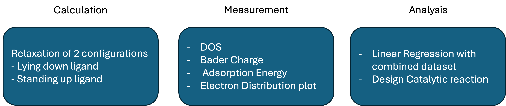
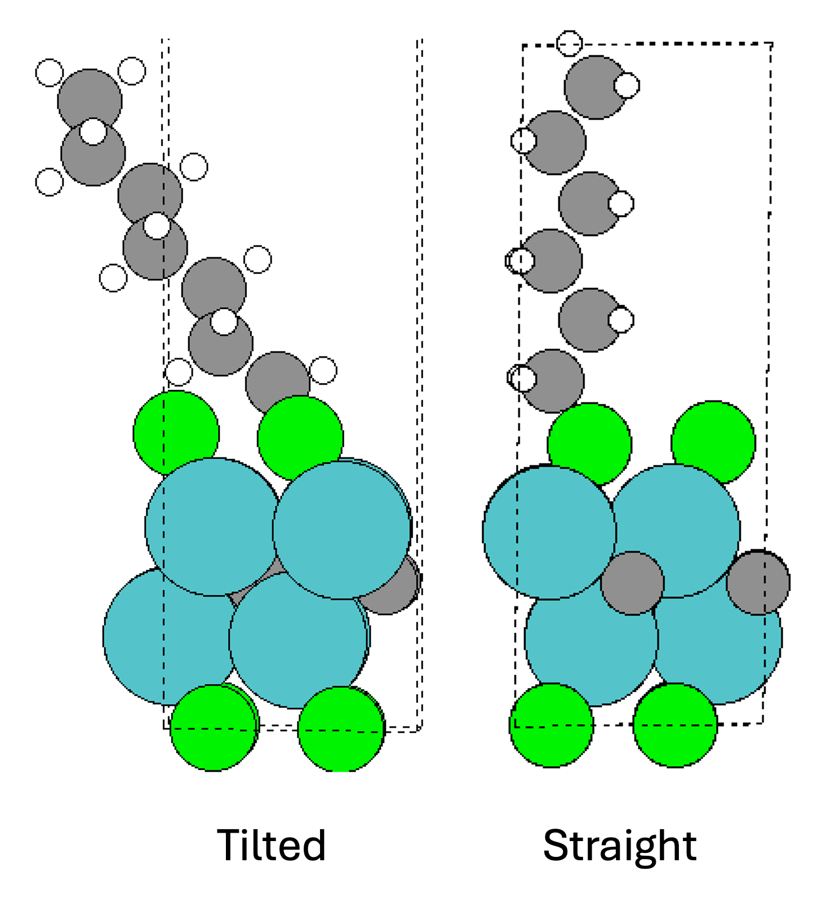
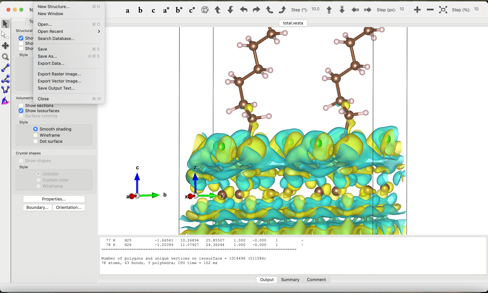
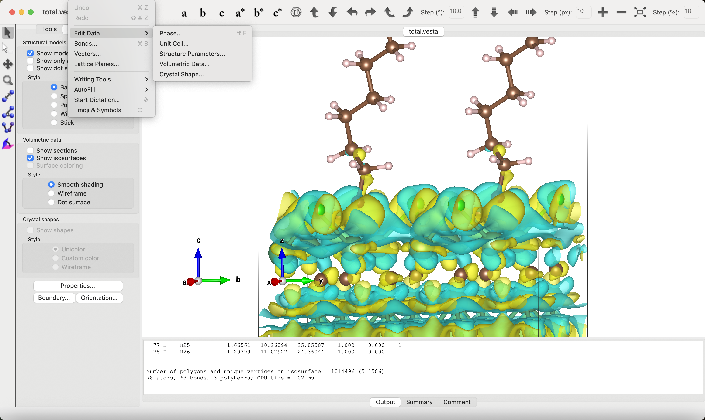
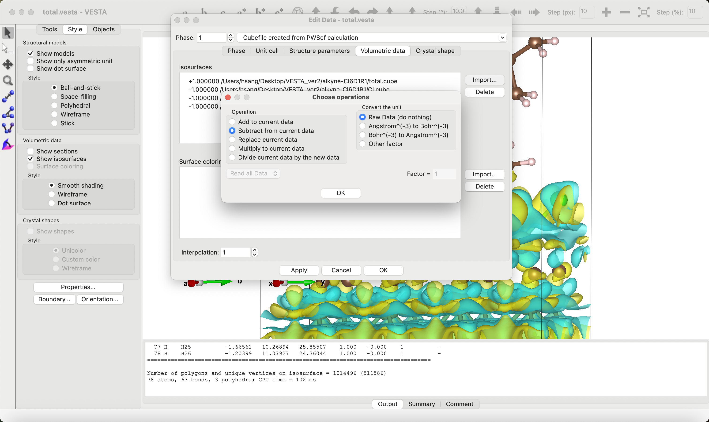
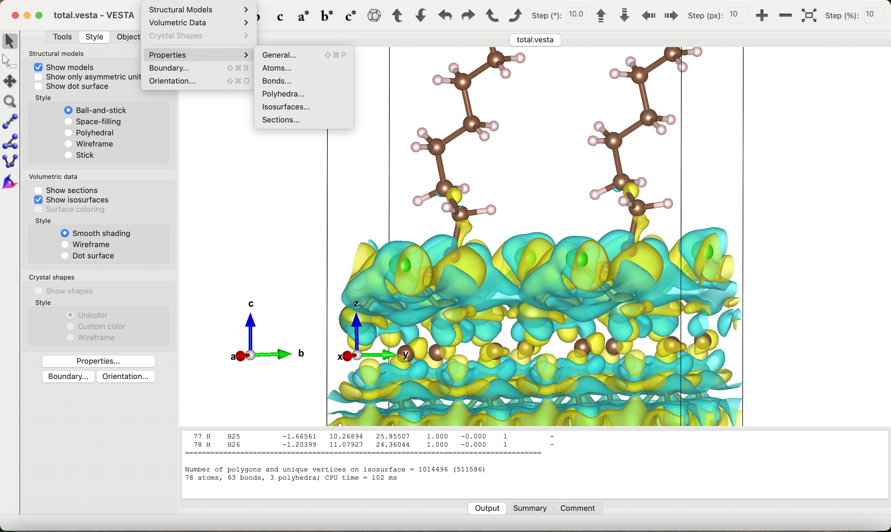
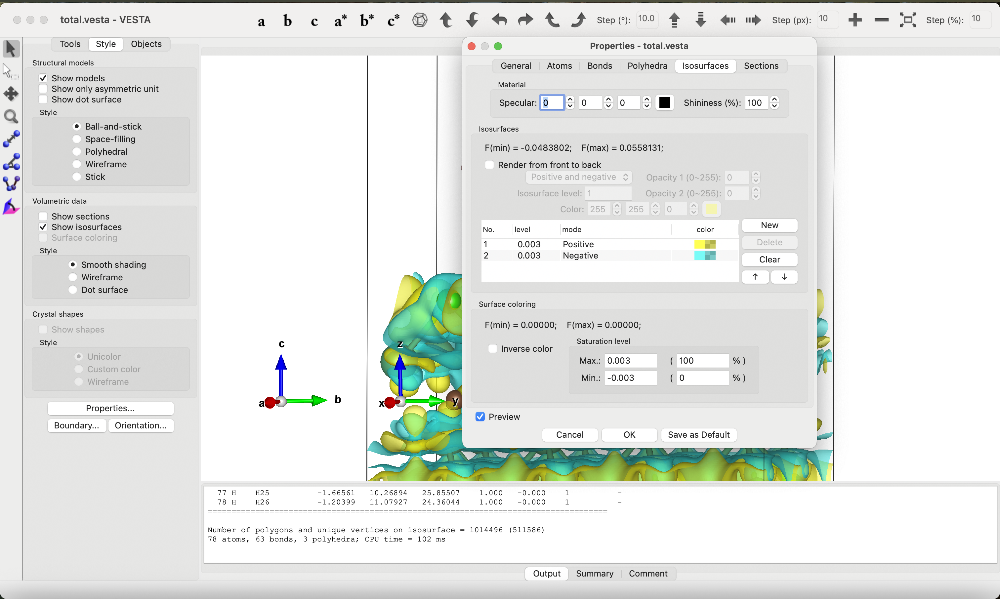

## Course Project Logistics ##

1. [Introduction](#intro)
2. [Motivation](#MO)
3. [Terms to Know](#Terms)
4. [Plan](#Plan)
5. [Individual Taksks](#ind)
6. [Final Report Rubric]()

Turn in your final report on CANVAS or email to:

```
alevoj@seas.upenn.edu, hsang@seas.upenn.edu
```

<a name='intro'></a>

## Project Introduction ##
Material: MXenes are an emerging family of two-dimensional transition metal carbides and nitrides with the general formula M<sub>n+1</sub>X<sub>n</sub>T<sub>x</sub> (n = 1-4), where M is an early transition metal (Sc, Ti, Zr, V, Nb, Ta, etc), X is C or N, and T is a surface group such as O, F, Cl, and OH. Its main properties are: scalable synthesis, solution processability, large surface-to-volume ratio, high metallic conductivity, and mechanical strength. Due to these properties, applications for energy storage, composites, and optoelectronics are being explored.

Goal: The main scientific goal is to design a potential catalytic reaction from functionalzied Nb<sub>2</sub>C MXenes. First, we will look at the Cl-terminated Nb<sub>2</sub>C MXenes and adsorb cycloalkane, cycloalkene, cycloalkyne from 1~10 carbon loop and find a thermodynamically optimal adsorption configuration by calculating the adsorption energy. And we will run DOS, bader charge calculations to analyze the system and probe into the electronic/thermodynamic properties of the system to design a possible pathway of catalytic reaction. 

<a name='MO'></a>

### Motivation ###

- **Synthesis of 2D Organometallic Material**: MXene is a 2 dimentional transitional metal carbide or nitride which allows the material to be easily tunable with surface modification to have drastically different properties. Organometallic materials are known to be a valuable source for A deeper understanding of thermodynamic stability and adsorption mechanism supports the advancement of sustainable and ecnomically attractive option for active electrocatalysts.

- **Adsorption Configuration and Optimization**: By modeling different surface configuration of the adsorption, we gain insight into how environmental conditions (vacancy, dehydrogenation, temperature, etc.) and configuration influence the adsorption stability. This could lead to optimization strategies that improve catalyst activity and stability by tuning vacancy rates and ligand environment.

- **Catalyst Design for Functional Efficiency**: Selecting catalysts with the right functional properties is crucial for enabling manufacturable technologies. This includes considerations for cost efficiency, performance, durability, raw material abundance, and environmental impact. This project will specifically lend itself toward oulining a framework for studying activity and stability of functionalized MXenes. 

- **Experimental Comparison and Data Validation**: By aligning the surface configuration, adsorption, and catalytic behaviors observed in simulations with those measured experimentally, we can validate our models and refine predictive accuracy. This comparison helps identify discrepancies, improve our understanding of real-world conditions, and build confidence in the applicability of the computational framework for guiding experimental design and optimizing catalyst performance.

<a name='Terms'></a>

## Terminology ##
- **High Symmetry Adsorption Sites**: FCC(Face-Centered Cubic), HCP(Hexagonal Close-Packed), TOP(Directly on surface metal site) and Bridge(Located halfway between two surface atoms, over the bond connecting them) are specific locations on a crystal surface with the highest degree of symmetry where functional groups or termination can bind.

- **Termination**: Termination refers to the specific arrangement and coordination of surface groups that are adsorbed to MXene during the synthesis of MXene from MAX phase. Different terminations, whether H, Cl, O, F, or OH significantly affect surface properties, including reactivity and stability, and can result from various synthesis methods.

- **Functional Groups**: Functional Groups refers to the specific groups that are adsorbed on the MXene through nucleophilic substitution of the termination with anion donors or by applying electrochemical potential to have partial elimination of termination group to adsorb designated functional groups.
  
- **Adsorption Energy**: Adsorption energy refers the the potential energy difference between the initial system and final system, where th energy of initial system are defined as  addition of adsorbate and adsorbent and energy of the final system is defined as the combined system's total potential energy. Thus the equation is defined as:
  E<sub>ads</sub> = E<sub>final</sub> -E<sub>init</sub>

- **Bader Charge Analysis**: Bader charge analysis is a computational method for partitioning a charge density grid into Bader(atomic) volumes. Bader volume is defined as a volume that contains a single charge density maximum, and is separated from other volumes by surfaces(zero-flux surface) where the charge density is the minimum normal to the surface. Charge density analysis is useful technique to compare your results with experimental results because it is an observable quantity that can be measured or calculated experimentally, while being insensitive to the basis set used.

- **Cyclo hydrocarbons**: Cyclo hydrocarbons refers to alkane, alkene and alkyne which contains at least one "ring" structure with in the carbon chain. Typically it has 2 less hydrogens compared to the structure without the ring. For example, alkane's formula is C<sub>n</sub>H<sub>2n+2</sub> while cycloalkane's formula is C<sub>n</sub>H<sub>2n</sub>.

- **Amine**: Amines are a class of organic compounds derived from ammonia NH<sub>3</sub> where one or more hydrogen atoms are replaced by alkyl or aryl groups. They are characterized by a nitrogen atom with a lone pair of electrons, with the formula -RNH.

- **Carboxyl Acid**: Carboxyl Acid is an organic compound that contains a carboxyl functional group, which is a carbon atom double-bonded to one oxygen atom and single-bonded to a hydroxyl (-OH) group. This -COOH group is responsible for their acidic properties, as they can donate a hydrogen ion in solution.

<a name='Plan'></a>

## Plan ##

For each sites in the basal plane, we need to go through the following path.



<a name='ind'></a>
### Detailed plan for Individual tasks ###

We will break into groups of 3-4 students and each group will be assigned a series of surfaces they will be responsible for.
   
       a. Cycloalkane - Group 1

       b. Cycloalkene - Group 2 

       c. Amine - Group 3

       d. Carboxylic Acid - Group 4

       Groups: 
         (1) Lily, Jiachun, Yoky, Zhanyuan
         (2) Anika, Brigid, Shellyn, Zaini 
         (3) Bo, Eric, Yerim
         (4) Erin, Haomin, Khue

Individual Task
1. Download the packages containing the adsorbates and necessary base structure(Relaxed Nb<sub>2</sub>C MXene, and Nb<sub>2</sub>CCl MXene)/files.
    ```bash
    wget https://upenncbe544.github.io/CBE544-2025/CBE5400.tar.gz
    tar -xzvf CBE5400.tar.gz
    ```
    Distribute the ligands among team members, each member should have 2 ligands. After downloading the ligands, remove one hydrogen from them, for cycloalkane hydrogen from any carbon, for cycloalkene, a hydrogen from carbon that contains a double bond, for carboxylic acid, remove from the -COOH to create -COO, and lastly for amine, remove from -NH2 to create -NH, or amido radical.
   
3. Adsorb and relax the structure on the 'bare' surface in 2 configuration where either it is tilted or standing up in two directions.
    a. Adsorb the first ligands straight and tilted using the adsorbate.py.
    Ex)
    
      Step 1. Adsorb the ligand standing straight up. 
      ```bash
      ads = io.read('pathway/to/adsorbate/scf.out')
      ```
      Change the default pathway to the pathway for your ligand. You can find the pathway to the ligand by using pwd command in the directory where it contains the scf.out file of ligand.
      Choose the index of the atoms in the ligand so that you get a straight chain. Then you need to choose the index atoms from the scf.out file of the bare system to designated sites. For fcc, you need to pick a metal atom from the bottom layer, and 2 adjacent metal atoms in the same layer. For hcp you need to pick a carbon atom and the 2 adjacent carbon atoms in the same layer. For tope site, you use the same settings as the fcc just on the top layer of metal. And for the position of adsorbate, input: fcc, hcp or top. The default setting should be the adsorbate standing straight up.
      Step 2. Adsorb the ligand tilted.
      Everything should be the same as the Step1, but you need to modify the angles in the code:
      ```bash
      if index4 == 'fcc' or index4 == 'top' or index4 == 'hcp':
      ads.rotate(90,v,reference_position_ads)
      if cpos[index_ads1][2] > cpos[index_ads2][2]:
          ads.rotate(180,v,reference_position_ads) <- Modify here
      else:
          ads.rotate(180,v,reference_position_ads)
      elif index4 == 'fcc-' or index4 == 'top-' or index4 == 'hcp-':
        ads.rotate(90, v, reference_position_ads) <- Modify here
      ```
      Try different angles(0, 30, 60) to have the ligand lying as close as possible to the surface without it colliding with the periodic counterpart. Make sure to record the angle you   have changed to.
   b. Adsorb the second ligands straight in the bottom layer in the same way. Instead of fcc, hcp, and top, utilze fcc-, hcp-, top-. You also need to pick the indexes of the surface atoms opposite for fcc and top, but same for hcp. However, you need to input fcc-, hcp- and top- for the positions. 
   c. Calculate the adsorption energies of each configuration to figure out the most optimal structure. The analysis from here on will be only done in the most optimal structure.

4. Run a DOS calculation on the relaxed structures, same as you did for homework 5.
      
      
5. Run Bader Charge calculation.
   a. First run command:
   ```bash
   cp /home/x-shan4/.bashrc ./
   source .bashrc   
   ```
   Copy pp.in and bader.sub to the directory you want to run bader charge calculation on. You need to check to see if that directory also contains calcdir, because pp.in takes input from the wave functions. After the bader.sub has been completed, you should see a new file has been generated: 'density.cube'
   Run command:
   ```bash
   bader density.cube  
   ```
  Which will generate the ACF.DAT file from density.cube file. You can read the ACF.DAT file to see how much electrons are assigned to each atoms based on the bader space. Run the bader charge analysis for the adsorbate as well, and you can compare how the total molecule & individual atoms have gained or lost electrons during the adsorption process.
   
5. Electron Distribution Plot.

   a. Make a new directories with different components. 1. bare_MXene, 2. adsorbate (3. Cl for Cl-terminated system) inside the folder where the relaxed structure is located. Copy your scf.out into all of the new directories.
    
   b. Open scf.out in all the directories and erase everything in the scf.out file except the part that is the name of the directory: for example, for adsorbate directory, erase all the atoms in the system except the ligand part. This is the process o isolating the individual components of the system to visualize the delta electron distribution of the system.

   c. After the parts , run a scf calculation on the system using the scf.py provided in the packet. After the scf calculation has converged, run bader charge calculation on the newly generated scf.out files.

   d. Download VESTA from [webpage](https://jp-minerals.org/vesta/en/).

   e. Download the density.cube files from each components(total system, adsorbate, MXene, termination) your local machine using scp command:
      ```bash
   scp x-you_id@anvil.rcac.purdue.edu:/path/to/the/density.cube /path/to/your/local/machine 
     ```
   f. Use VESTA to visualize the delta electron distribution of adsorption by subtracting the volumetric data of adsorbate, MXene, and termination from the total system. Set the isosurface value to 0.003, and keep the positive delta charge region color yellow, and negative delta charge region blue. 
     
     
     
     
     
